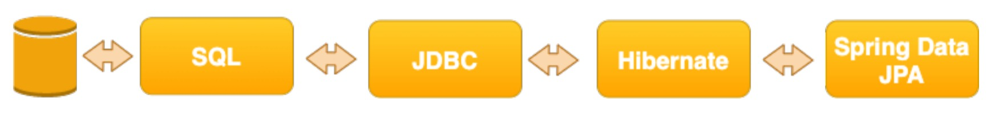
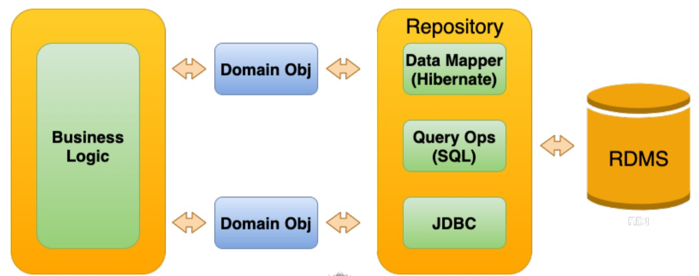

# Introduction à Spring Data JPA

## I) Qu’est-ce que Spring Data JPA ?

+ `Spring Data JPA`: version basée sur `JPA` pour l'accès au référentiel de données de la famille Spring Data de
projets
    + `Spring Data` a de nombreuses implémentations pour divers magasins de données, notamment :
        + **MongoDB, Redis, Cassandra, GemFile, Couchbase, Neo4J**
+ `Spring Data JPA` se concentre sur la prise en charge de la norme **`API JPA`**.

  + Généralement utilisé pour accéder aux bases de données relationnelles basées sur **SQL**.
    + Généralement car certains magasins de données **`NoSQL`** offrent la prise en charge de **JPA**.

## 2) Qu’est-ce que JPA ?
+  `Spring Data JPA`: est une couche d'abstraction construite sur **JPA**.
+ **JPA**–API de persistance Java
+ **JPA** est une API courante pour travailler avec des bases de données relationnelles.
  + Généralement des bases de données **SQL**, mais a été utilisé avec certaines banques de données NoSQL.
+ **Hibernate** est une implémentation de **JPA**
  +  **JPA** n'est que l'interface de l'API; **JPA** n'est pas une implémentation
+ D'autres implémentations incluent **EclipseLink, Apache OpenJPA et TopLink**.

## 3) Qu’est-ce que **Hibernate** ?
+ **Hibernate** - Est un outil de mappage relationnel objet qui implémente également la spécification **API JPA**.
+ **ORM**–Mappage relationnel d'objets
    + **Java** est un langage de programmation orienté objet fortement typé
    + Les bases de données SQL conservent les données à l'aide d'un modèle de données relationnel.
    + Les **ORM** cartographient les données entre les paradigmes relationnel et orienté objet.
+ **Leakage** : terme désignant un paradigme **Leakage** dans l'autre modèle.
+ La valeur ID est considérée comme une **Leakage**. L'ID est la clé primaire du modèle relationnel et doit
être transféré au modèle objet.

## 4) Qu’est-ce que SQL ?
+ **Hibernate** effectue des opérations de base de données à l'aide de SQL
+ **SQL** – Langage de requête structuré, alias **suite**
+ Développé à l'origine au début des années 1970 par les ingénieurs IBM
+ Largement adopté par toutes les bases de données relationnelles et même certaines bases de données NoSQL
+ **ANSI SQL** - est la norme pour le langage **SQL**
  + Les bases de données SQL prendront en charge **ANSI SQL** et leur propre version de SQL.
+ **Hibernate** privilégiera l'utilisation de **ANSI SQL** pour la portabilité.

## 5) Qu’est-ce que JDBC ?
+ **JDBC** – Connectivité de la base de données Java
+ **JDBC** est l'API Java pour la connexion aux bases de données
  + Encore une fois, uniquement **l'API–PAS l'implémentation**.
+ L'implémentation JDBC est généralement appelée **Driver JDBC**.
+ Chaque base de données aura sa propre implémentation de pilote JDBC.
+ `LeDriver JDBC` gère les communications de bas niveau avec la base de données
+ Chaque pilote implémentera l'API JDBC et disposera d'extensions spécifiques à la plate-forme.

## 6) Mettre tous ensemble

## 7) Spring Data JPA - L'abstraction
+ **Spring Data JPA** : est une couche d'abstraction
+ Simplifie votre expérience de programmation.
+ Vous ne vous inquiétez pas des éléments de bas niveau tels que les connexions et les transactions aux bases de données.
+ Vous pouvez y accéder et les contrôler en cas de besoin
+ **Spring Data JPA** utilise la couche **API JPA**
  + Vous pouvez toujours accéder aux fonctionnalités spécifiques à l'implémentation en cas de besoin.

## 8) Le modèle de référentiel
+ **Spring Data JPA**– implémente le modèle de référentiel
+ Le modèle de référentiel a été introduit dans le **livre Domain Driven Design en 2004**.
  + Excellent livre d'ailleurs
+ Le référentiel est une abstraction de données et d'opérations de persistance
+ Vous souhaitez conserver vos objets de domaine **Persistance Ignorant**
+ Fournir une interface pour les opérations **CRUD**, la mise en œuvre gérera toutes les opérations de persistance
+ Dans **Spring Data JPA**, vous fournissez l'interface, **Spring Data JPA** fournit l'implémentation.

## 9) Quand utiliser JPA ?
+ **Spring Data JPA** - est très efficace pour les opérations CRUD à objet unique
+ Lorsque vous effectuez plusieurs opérations sur un petit ensemble d'objets
+ Comme une opération de paiement dans une application de boutique en ligne
+ **Hibernate** mettra en cache et regroupera les opérations de base de données pour plus d'efficacité.
+ Lorsque vous contrôlez le schéma de la base de données.

## 10) Quand NE PAS utiliser JPA?
+ Spring Data JPA - n'est pas très adapté aux opérations par lots 
+ Il y a un coût à récupérer un seul enregistrement de la base de données et à le mapper à un objet Java.
+ Amende pour des opérations simples, coûteuse pour des dizaines de milliers d'opérations
+ Les bases de données relationnelles sont très efficaces dans ce qu'elles font
+ SQL est un langage très puissant
+ Si vous effectuez des opérations par lots sur des dizaines de milliers d'enregistrements, vous devez envisager
en utilisant SQL/JDBC.

## 11) Résumé
+ **Spring Data JPA** - est une abstraction qui implémente le modèle de référentiel
+ L'Abstraction nous cache **la complexité de SQL, JDBC, JPA (Hibernate)**
+ Cela nous permet de consacrer davantage de temps à la logique métier.
+ Même si la complexité est cachée, il est toujours important de comprendre ce que fait l'abstraction
+ La plupart des difficultés liées à l'apprentissage de Spring Data JPA proviennent de la non-compréhension du principe sous-jacent.
les technologies
+ À venir, nous examinerons Spring Data JPA, puis nous concentrerons sur la « magie » qui en est extraite.

## H2 Database

