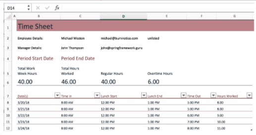
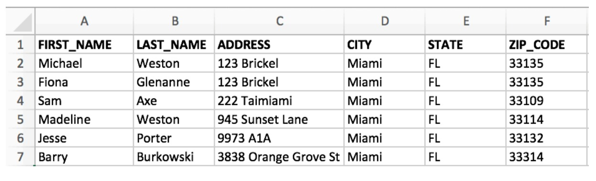
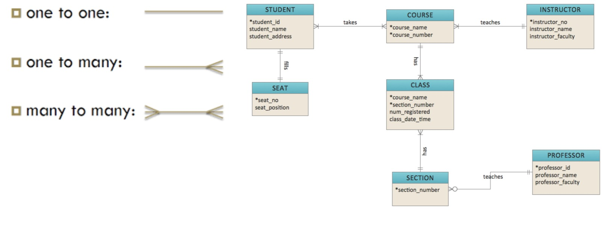
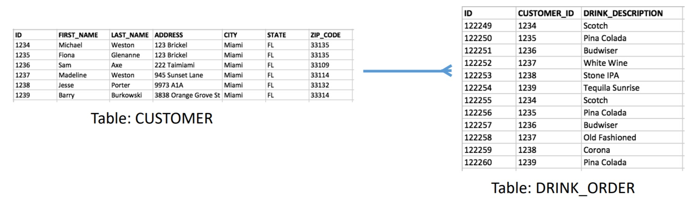
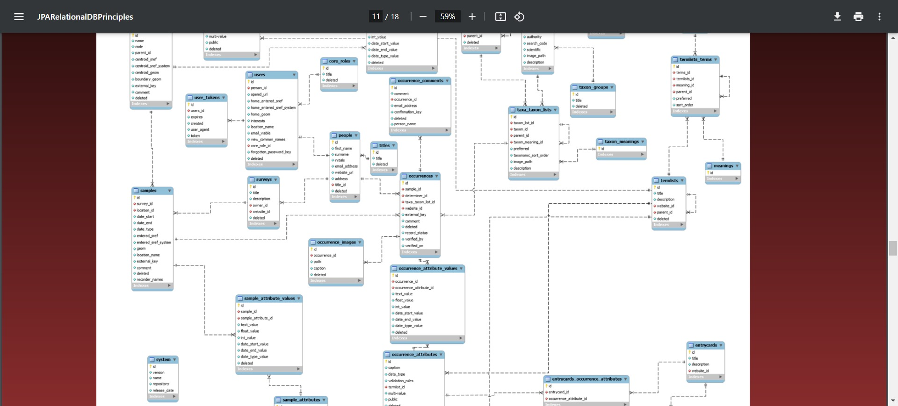
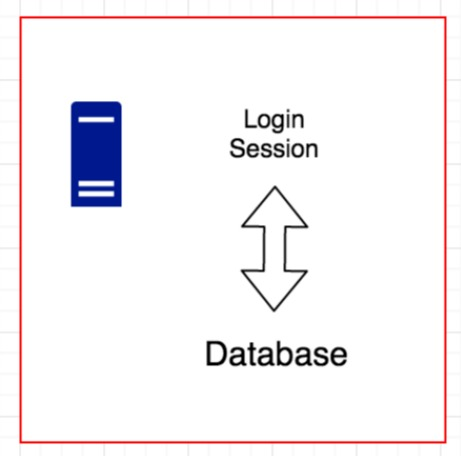
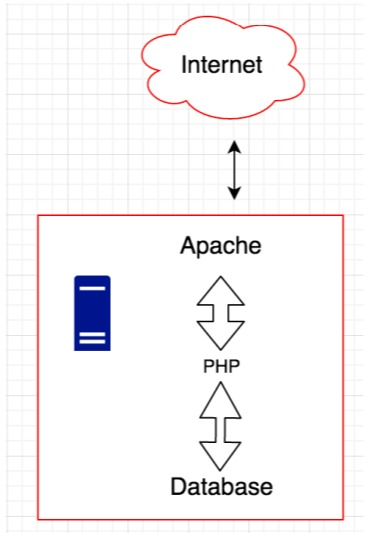
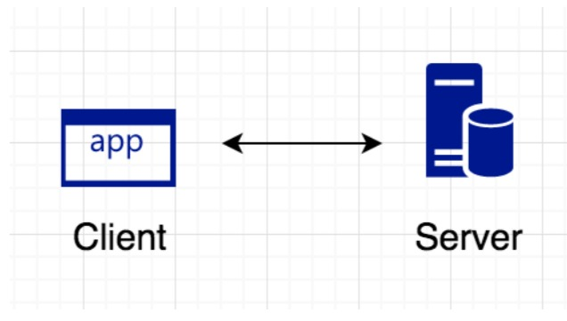
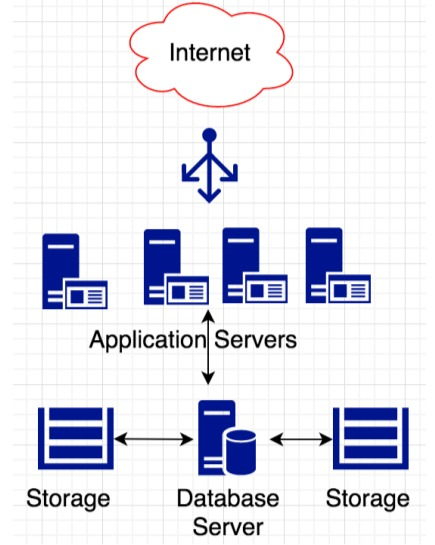
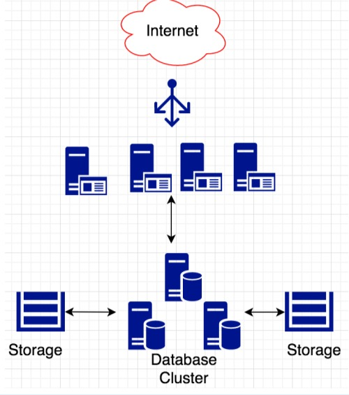

## I) Qu'est-ce qu'une base de données ?

### 1) Qu'est-ce qu'une base de données ?
+ Une **Base de données** est un ensemble de données liées et la façon dont elles sont organisées.
+ **Une feuille de calcul de suivi des données** pourrait être considérée comme une base de données.
  + Par exemple, vous utilisez une feuille de calcul pour le suivi du temps.
    + Il s'agirait d'un ensemble de données connexes, c'est-à-dire les heures d'un employé pour la semaine.
    + Les **données** pourraient croître avec le temps.
    + Les **Données** peuvent concerner plusieurs employés.
    + Les **Données** peuvent servir d'enregistrement pour ce que vous devez payer à l'employé.

### 2) Caractéristiques des données
+ Les bases de données, comme les feuilles de calcul, font des distinctions importantes concernant les éléments de données.
  + L'élément est une donnée, comme **nom** - c.-à-d. Michael Weston
+ Le nom « Michael Weston » est considéré comme une **chaîne**
+ **20/03/18** est considéré comme une **date**.
+ L'heure à 8h00 est considérée comme une **heure**.
+ Le total des heures travaillées (46,00) est considéré comme un **nombre**.
+ Nous examinerons les types de données de plus près dans une prochaine conférence.

### 3) Systèmes de gestion de bases de données
+ Les systèmes de gestion de bases de données sont des programmes informatiques spécialisés pour les bases de données. Souvent
abrégé en **SGBD**.
+ Les **SGBD** ont 4 caractéristiques importantes :
  + **Définition des données** - définissez les données suivies.
  + **Manipulation des données** - ajouter, mettre à jour ou supprimer des données.
  + **Récupération de données** - extraire et rapporter les données dans la base de données.
  + **Administration** - définition des utilisateurs sur le système, sécurité, surveillance, administration du système

### 4) Types de bases de données
+ Il existe différents types de bases de données. Certains sont à usage général, d'autres sont très
spécialisé.
  +  **Base de données de fichiers plats** - Les données sont conservées dans un fichier sur le système d'exploitation. Très simple, en général
considéré comme dépassé.
  + **Base de données relationnelle** - Les données sont conservées dans des tables de base de données, qui ont des « relations » les unes avec les autres.
    + Nous explorerons les bases de données relationnelles de manière beaucoup plus approfondie dans une prochaine conférence.
  + **Base de données hiérarchique** - Les données sont conservées dans une structure arborescente.
  + **Base de données NoSQL** - Ce segment est un groupe de bases de données spécialisées contenant une variété de données
    modèles - mais n'utilisez pas SQL.
    + **Les modèles de données incluent** : magasin de valeurs-clés, basé sur des documents, basé sur des colonnes.
  + **Bases de données distribuées/Cloud** – Conçues pour fonctionner sur de nombreux serveurs pour des performances massivement évolutives et
    systèmes hautement disponibles. Souvent, NoSQL.
    + Pensez à **Facebook, Amazon et Google**
    + Entreprises à l'échelle du **Cloud**

## II) Principes des bases de données relationnelles

### 1) Bases de données relationnelles
+ Les bases de données relationnelles stockent les données dans des tables qui ont des relations avec d'autres tables.
+ Le modèle relationnel a été proposé pour la première fois par **Edgar F. Codd en 1969**.
+ Presque toutes les bases de données relationnelles modernes utilisent SQL pour la définition et la manipulation des données.
   + **SQL** – Langage de requête structuré
+ Les bases de données relationnelles sont les bases de données les plus utilisées au monde.
  + Utilisé dans les téléphones intelligents, les ordinateurs de bureau, les automobiles et très populaire dans les entreprises

### 2) Tableau de base de données
+ **Une table de base de données** ressemble beaucoup à une feuille de calcul.
+ Les données sont conservées dans **des colonnes et des lignes**.
 Chaque **colonne** est affectée :
  + Un **nom unique**, identifiant un nom lisible par l'homme de la colonne. (c'est-à-dire FIRST_NAME, LAST_NAME)
  + Un **type de données** (c'est-à-dire : chaîne, date, heure, nombre, etc.)
  + Facultativement, des contraintes (c'est-à-dire : une valeur est-elle requise ?, Longueur de la chaîne, etc.)
+ Chaque **ligne** est un enregistrement de base de données distinct.

### 3) Exemple de table de base de données

### 4) Clé primaire
+ **Une clé primaire** est une ou plusieurs colonnes de base de données spéciales facultatives utilisées pour identifier un enregistrement de base de données. Remarque : facultatif, mais non recommandé!
+ **Unique** : il ne peut y en avoir qu'un ! Comme Highlander !
+ Il peut s'agir de FIRST_NAME, LAST_NAME ou de FIRST_NAME et LAST_NAME.

### 5) Clé de substitution
+ **Une clé de substitution** est un type de **clé primaire** qui utilise une valeur générée unique.
+ Ne devrait avoir aucune valeur commerciale et ne devrait jamais changer.
+ Généralement, un numéro généré automatiquement par le système. Peut être une chaîne unique (UUID).
+ Considéré comme **une bonne pratique** en matière de conception de bases de données relationnelles.
+ Cela correspondra généralement à la valeur **@Id** de votre entité.

### 6) Clé naturelle
+ **Une clé naturelle** est un type de **clé primaire** qui utilise une ou plusieurs colonnes de données.
+ Ce n'est pas une bonne pratique car elle est liée aux données commerciales, qui peuvent changer
+ Généralement rencontré avec les bases de données existantes
+ Soutenu par JPA, sera abordé plus tard dans le cours
+ Peu de raisons d'utiliser des clés naturelles, l'une est un tableau de « codes » pour les valeurs de configuration.

### 7) Relations entre les tables de base de données
+ Défini via **des contraintes de clé étrangère** en conjonction avec des clés primaires.
+ Types de relations :
  + **Un à un (One To One)**: l'enregistrement du tableau A correspond exactement à un enregistrement du tableau B.
  + **Un à plusieurs (One To Many)**: l'enregistrement du tableau A correspond à plusieurs enregistrements du tableau B, mais le tableau B ne correspond qu'à un seul enregistrement.
  dans le tableau A. (Pensez - Une commande avec plusieurs articles)
  + **Plusieurs à plusieurs (Many To Many)**: l'enregistrement du tableau A correspond à plusieurs enregistrements du tableau B et le tableau B correspond à plusieurs enregistrements.
  dans le tableau A.

### 8) Diagramme entité-relation

### 9) Exemple de relation un à plusieurs

### 10) Contraintes de base de données
+ **Une contrainte de base de données** est une règle appliquée aux données stockées dans la base de données.
+ **Non Null/ Not Null** : la colonne ne peut pas contenir de valeurs nulles.
+ **Unique** : la valeur de la colonne doit être unique.
+ **Clé primaire / Primary Key** : Identifiant de la ligne, combine Non Null et Unique
+ **Clé étrangère / Foreign Key** : la valeur doit exister dans la table référencée (étrangère), c'est-à-dire l'intégrité référentielle.
+ **Contrainte de vérification / Check Constraint** : Définit la condition sur les données - comme min max ou liste de valeurs **(ENUM)**.

### 11) Transactions de base de données
+ **Une transaction de base de données** est une série d'une ou plusieurs instructions DML.
+ Une transaction a un début et une fin
+ La validation rendra les modifications de données permanentes.
+ Une restauration ramènera les données modifiées à leur état d'origine.

### 12) ACID
+ Qu'est-ce que l'ACID ?
  + **Atomicité** - tout ou rien
  + **Cohérence** - les transactions sont valides selon les règles de la base de données
  + **Isolement** - Les résultats des transactions sont comme s'ils étaient effectués de bout en bout
  + **Durabilité** – Une fois qu'une transaction est engagée, elle le reste.

### 13) Transactions et ACID – Qu’est-ce que cela signifie ?
+ **Atomicité** : Toutes les déclarations doivent pouvoir être complétées
+ **Cohérence** : les modifications ne violent pas les contraintes
+ **Isolation** : Lit à l’intérieur de la transaction **voir** les données modifiées. Lit la transaction externe **voir** les données originales (jusqu'à la validation)
+ **Durabilité** : Une fois engagés, les changements sont permanents
+ Facile avec un seul utilisateur, devient très complexe avec de nombreux utilisateurs effectuant des transactions !.

### 14) Mises à jour perdues
+ ACID peut entraîner des mises à jour perdues
+ Michael lit que le solde est de 10 et décide d'en ajouter 5. Ainsi : 10 + 5 = 15
+ Avant que Michael ne s'engage, Sam lit que le solde est de 10 et décide d'en ajouter 10. Ainsi 10 + 10 = 20
+ Les soldes réels doivent être 10 + 5 + 10 = 25.
+ Mais le solde est mis à jour à 20, car la mise à jour de Michael est « perdue » puisque la transaction de Sam ne « voit » jamais la valeur mise à jour.

### 15) Prévenir les mises à jour perdues
+ Le verrouillage est une technique qui peut être utilisée pour éviter la perte de mises à jour.
+ **Le verrouillage pessimiste** utilise un verrouillage de base de données pour empêcher les transactions en vol et permettra aux transactions de se terminer de manière séquentielle. c'est-à-dire - Sélectionnez pour la mise à jour, attendra un verrou exclusif
+ **Verrouillage optimiste** : utilise une propriété de version qui est vérifiée dans la mise à jour.

## III) Qu'est-ce qu'un système de gestion de base de données relationnelle ?

### 1) SGBDR
+ **SGBDR** - Système de gestion de base de données relationnelle - Type de SGBD spécifiquement pour les bases de données relationnelles
+ **REVUE** - Les SGBD ont 4 caractéristiques importantes :
  + **Définition des données** - définir les données suivies
  + **Manipulation des données** - ajouter, mettre à jour ou supprimer des données
  + **Récupération de données** - extraire et rapporter les données dans la base de données
  + **Administration** - définition des utilisateurs sur le système, sécurité, surveillance, administration du système

### 2) Prise en charge de SQL et du langage
+ **SGBDR** - Tous prennent en charge ANSI SQL
+ Prend également en charge leur propre version de SQL
  + **MySQL** est différent d'Oracle qui est différent de MS SQL Server
+ Peut prendre en charge leur propre langage pour les procédures stockées et les déclencheurs
  + Cela varie selon la plateforme.

### 3) Définition des données
+ **DDL - Data Definition Language (ie CREATE TABLE…)** est utilisé pour définir le modèle relationnel
+ Sous les couvertures, le SGBDR stockera les données sur vos tables dans les tables du catalogue.
+ Le logiciel est utilisé pour garantir que les données stockées sont conformes aux règles que vous avez définies pour les données.
  + Vous ne pouvez pas stocker de texte (chaîne) dans un champ numérique
  + Vous devez fournir une valeur - NOT NULL.

### 4) Manipulation de données
+ **DML** – Langage de manipulation de données
+ Vous permet d'ajouter **(INSERT)**, de modifier **(UPDATE)** ou de supprimer **(DELETE)** des données.
+ Le **SGBDR** applique la manipulation des données en respectant les règles de la définition des données.
+ Le **SGBDR** permet de définir des **règles** pour les systèmes multi-utilisateurs.
+ Ces règles gèrent ce qui se passe dans des conditions concurrentes. (que se passe-t-il lorsque deux utilisateurs souhaitent mettre à jour les mêmes données, en même temps)
+ **Assure l'intégrité des données** : que se passe-t-il lorsque les choses tournent mal ?

### 5) Récupération de données
+ La récupération de données consiste à extraire des données de la base de données.
+ Le SGBDR détermine la manière optimale de récupérer les données de la base de données.
+ Les jointures multi-tables peuvent devenir très complexes.
  + Considérez des tableaux comportant des milliards et des milliards de lignes.
  + Les rapports peuvent aller de quelques secondes à plusieurs heures lorsque la stratégie de récupération est erronée.
+ Le SGBDR prend également en compte ce qui se passe lorsque des mises à jour se produisent pendant l'exécution de votre rapport.

### 6) Administration
+ Utilisateurs : le **SGBDR** définit les comptes d'utilisateurs.
+ Les comptes d'utilisateurs ont des rôles de sécurité qui contrôlent ce que les utilisateurs individuels peuvent voir, mettre à jour, supprimer, etc.
+ Les **SGBDR** disposent d'outils permettant d'afficher des mesures de performances pouvant être utilisées pour identifier les opérations coûteuses.
+ L'administration système comprend :
  + Définir les utilisateurs
  + Où la base de données stocke ses données sur le système informatique
  + Sauvegardes et audit

### 7) Comment les données sont-elles stockées ?
+ **SGBDR** - Contrôlez la façon dont les données sont stockées sur le disque
+ Peut contenir quelques fichiers
+ Peut être très TRÈS complexe réparti sur plusieurs lecteurs ou périphériques réseau
+ Cela devient plus important sur les systèmes de bases de données plus grands

### 8) Meilleures pratiques administratives
+ Utilisez un schéma pour votre application
+ N'utilisez pas de compte **super-utilisateur** pour l'utilisateur de votre application.
+ Appliquer le principe des autorités minimales
+ Compte utilisé par l'application, souvent appelé "compte de service".
+ Le compte de service ne doit avoir qu'un accès CRUD.
+ Le compte de service ne doit pas être en mesure d'effectuer des opérations DDL.
  + Empêche les actes malveillants via des attaques par injection SQL.

## IV) Histoire et aperçu de MySQL

### 1) Origines de SQL
+ 1970 Le Dr Codd publie un article sur le modèle de données relationnelles.
+ Initialement développé au début des années 70 par Donald Chamberlin et Raymond Boyce.
+ En 1973, Chamberlin et Boyce ont commencé à travailler sur SEQUEL.
+ Acronyme signifiant « Langage de requête anglais structuré ».
+ Changé plus tard par **SQL** en raison d'un conflit de marque avec une compagnie aéronautique britannique.
+ Voyant la promesse du modèle de base de données relationnelle, à la fin des années 1970, une société appelée **Relational Software, Inc.** a commencé à travailler sur un SGBDR basé sur SQL et l'a vendu à des agences gouvernementales américaines.

### 2) Historique SQL
+ **1979, Relational Software, Inc.** a lancé le premier système de gestion de base de données relationnelle disponible dans le commerce.
+ Relational Software, Inc. a ensuite changé son nom pour Oracle.
+ 1995 - La société suédoise MySQL AB lance MySQL pour un usage interne.
+ Développeurs MySQL originaux inclus : Michael (Monty) Widenius, David Axmark, Allan Larsson.
  + MySQL nommé d'après la fille de Monty, **My**
+ En 2006, MySQL comptait 8 millions d'installations, 320 employés dans 25 pays.
  + 2008 – Sun Microsystems achète MySQL.

### 3) Historique SQL (suite)
+ **2010** - Oracle rachète Sun Microsystems (avec MySQL et Java)
+ **2012** - Michael (Monty) Widenius quitte Sun Microsystems et développe un fork de MySQL appelé MariaDB.
  + En grande partie par souci de l'avenir de MySQL.
  + L'API MariaDB reste 100% compatible avec MySQL.

### 4) À propos de MySQL
+ Avec plus de 100 millions de téléchargements, MySQL est la base de données la plus populaire de l'histoire.
+ **MySQL** est un système de base de données relationnelle (alias RDMS)
+ **MySQL** appartient à Oracle, mais MySQL est open source et gratuit.
+ Officiellement prononcé **My Ess Que Ell**

### 5) Fonctionnalités MySQL
+ MySQL est un système de gestion de base de données relationnelle
+ **SQL** signifie Structured Query Language.
  + MySQL prend en charge la norme ANSI/ISO SQL
+ MySQL est développé en C et C++, ce qui le rend portable sur de nombreuses plates-formes différentes.
+ MySQL est très rapide, stable et évolutif.
+ Il existe des clients MySQL pour toutes les langues populaires.
  + C, C++, Eiffel, Java, Perl, PHP, Python, Ruby, Tcl et ODBC, JDBC, ADO.NET.

### 6) Fonctionnalités MySQL
+ Procédures stockées
+ Déclencheurs
+ Curseurs
+ Vues mises à jour
+ Cache de requêtes
+ Sous-sélections

### 7) Éditions MySQL
+ **Édition communautaire MySQL - gratuite !**
  + Open Source sous GPL, utilisation gratuite.
  + C'est l'édition que nous utiliserons dans le cours.
  + Support communautaire uniquement

+ **MySQL Standard Edition** - Abonnement annuel (2,000$/an, par ~ serveur)
  + Assistance 24h/24 et 7j/7 d'Oracle
  + Techniquement identique à Community Edition, mais avec le support d'Oracle.

### 8) Éditions MySQL (suite)
+ **MySQL Enterprise Edition** – (5000$/an par ~serveur)
  + Fournit des fonctionnalités pour le routage et le partitionnement du cluster.
  + Inclut des outils d'entreprise pour la surveillance, les sauvegardes et la sécurité
  + Regroupement de threads pour une augmentation significative des performances sous des charges importantes
+ **MySQL Cluster CGE** – (10000$/an par ~serveur)
  + Conçu pour une évolutivité quasi linéaire grâce au clustering.
  + Volume élevé, haute disponibilité.

## V) Architectures de déploiement de SGBDR

### 1) Architectures de déploiement de SGBDR
+ Les SGBDR peuvent être déployés de différentes manières.
+ Est généralement motivé par des besoins d'évolutivité et de disponibilité.
+ Peut être effectué sur un seul serveur non dédié ou sur plusieurs serveurs dédiés.
+ La communication s'effectue généralement via une prise réseau.
+ Le client aura besoin d'un logiciel appelé « pilote » pour communiquer avec la base de données via la prise réseau.

### 2) Serveur simple non dédié
+ Serveur unique (ordinateur).
+ RDMBS est installé.
+ L'utilisateur se connecte et accède à la base de données à partir de ligne de commande.
+ Configuration la plus simple.
+ On parle souvent de **localhost** et d'une prise réseau sur localhost.

### 3) Pile de LAMPES
+ **LAMP = Linux, Apache, MySQL, PHP**
+ Très populaire.
+ **springframework.guru** l'utilise.
+ La plupart des sites Web fonctionneront sur un seul serveur.
+ L'inconvénient est que la base de données et Apache sont en concurrence pour les ressources limitées du serveur.

### 4) Serveur client
+ **Client Serveur** était à la mode dans les années 90.
+ Concept de déplacement du code d'application vers le client et différents matériels, tout en utilisant le matériel dédié pour le serveur de base de données.
+ Décharge la charge de l'application du serveur de base de données
+ Encore fréquemment utilisé sous une forme ou une autre

### 5) Mise à l'échelle du serveur client
+ L'évolutivité est obtenue en effectuant le traitement sur les serveurs d'applications.
+ Le serveur de base de données est dédié.
+ Souvent, les entreprises augmentent la taille de leur serveur de base de données pour se développer davantage.
+ Le stockage des données est déchargé sur un serveur dédié matériel.

### 6) Évoluer encore plus haut
+ Plusieurs serveurs sont utilisés pour la base de données
+ Exemple – Oracle Real Application Cluster
+ Améliore l'évolutivité sur un seul serveur de base de données.
+ Améliore la fiabilité puisqu'un nœud peut être perdu, et le cluster de bases de données continuera.
+ Des performances de type « mainframe ».

### Aller encore plus haut ?
+ À l'échelle du cloud : pensez à Amazon, Google, Facebook.
+ Informatique distribuée : la charge est répartie sur de nombreux serveurs.
+ Des serveurs de base bon marché sont souvent utilisés.
+ Les grands systèmes de type mainframe sont évités.
+ Paradigme significativement différent de celui de Client Serveur.
+ Les `SGBDR` ne sont généralement pas utilisés en raison de limitations d'évolutivité.
+ Par conséquent, hors du cadre de ce cours.

### Documentation

+ [SQL-DATA-TYPES](https://www.digitalocean.com/community/tutorials/sql-data-types)
+ [MySQL-DATA-TYPES](https://dev.mysql.com/doc/refman/8.0/en/data-types.html)
+ [HIBERNATE-DATA-TYPES](https://docs.jboss.org/hibernate/orm/5.0/mappingGuide/en-US/html/ch03.html)

