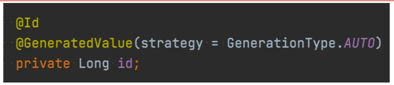

# Hibernate les clés primaires

## Clés primaires numériques

+ **GenerationType.AUTO** - Laisser Hibernate Pick - la meilleure pratique consiste à spécifier
+ **GenerationType.SEQUENCE** - Utiliser la séquence de base de données (pas une fonctionnalité de MySQL)
+ **GenerationType.IDENTITY** : utiliser des colonnes de base de données auto-incrémentées
+ **GenerationType.TABLE** - Utiliser la table de base de données pour simuler une séquence
  + C'est ce que nous utilisons, la moins évolutive des options.

## Clés primaires UUID
+ **UUID (you-id)** : identifiant universel unique, une valeur unique de **128 bits**.
+ Commun à utiliser comme clé primaire, peut aider à indexer les performances
  + L'inconvénient est qu'il utilise plus d'espace disque.
+ **IETF RFC 4122** - une norme internationale pour la génération d'**UUID**
  • **Hibernate** implémente par défaut un générateur personnalisé
  • **Hibernate** peut être configuré pour générer un UUID conforme à **la norme IETF RFC 4122**.

## Clés primaires naturelles
+ **Clés primaires naturelles** : une valeur unique ayant une signification commerciale en dehors de la base de données.
+ **Un UPC ou un ISBN** pourraient être considérés comme une clé naturelle, puisque les deux sont censés être uniques.
+ Commun dans les anciennes bases de données héritées
+ NON considéré comme une bonne pratique

## Clés primaires composites
+ **Clés primaires composites** : deux valeurs ayant une signification commerciale combinées pour créer une valeur unique
+ Non considéré comme une bonne pratique
+ Également courant dans les bases de données existantes

## Lequel utiliser ???
+ **Petite table** - c'est-à-dire quelques millions de lignes - numéro préféré (entier ou long)
+ **Grande table** - c'est-à-dire des dizaines de millions ou de milliards - privilégiez **l'UUID (si l'espace disque le permet)**
+ Évitez généralement d'utiliser des clés naturelles ou composites.
  + Très bien dans les cas extrêmes, comme une petite table de recherche de code

## À venir dans le cours
+ **Exemples de clé primaire Hibernate**
  + **Incrémentation automatique** : tableau déjà affiché, séquence non prise en charge par MySQL
  + **UUID**
  + **UIID RFC 4122**
  + **Clé naturelle**
  + **Composite**
+ L'objectif de la section est de vous fournir un livre de recettes pour référence future.