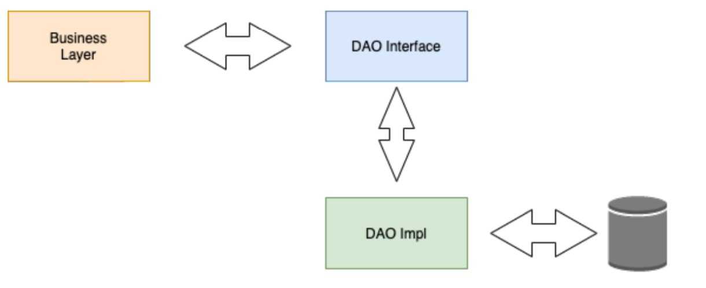

# Modèle DAO Java

## Modèle DAO Java
+ **DAO** - Objet d'accès aux données
+ **Pattern** était un **précurseur** de **JPA**, avant que les ORM ne deviennent populaires
+ Plus ancien et utilise JDBC pour l'accès aux données.
+ Commun à voir dans les applications J2EE héritées
+ Bien que son utilisation ne soit plus courante, c'est un bon moyen d'utiliser JDBC.
+ Très similaire au modèle de référentiel utilisé par Spring Data

# Modèle DAO Java
+ **Modèle DAO** : le but est d'isoler les opérations de persistance de la couche d'application.
+ Par exemple, lorsque l'application doit conserver un objet, elle ne devrait pas avoir besoin de comprendre la technologie de persistance sous-jacente.
+ **Classe de domaine** – POJO simples, identiques aux entités JPA.
  + REMARQUE : le modèle DAO n'utilisera pas les annotations JPA.
+ **API DAO** – Fournit une interface pour les opérations CRUD (similaire au référentiel)
+ **Implémentation de DAO** - Implémentation de la fonctionnalité de persistance

# Modèle DAO Java

# Spring BootJDBC
+ **Connexion à la base de données** : généralement avec JDBC, vous devez créer et gérer la connexion à la base de données.
+ Spring Boot configurera automatiquement la connexion à la base de données pour nous
+ Les composants de connexion à la base de données sont disponibles sous forme de Spring Beans dans le contexte Spring.

# À venir dans le cours
+ **JDBC DAO** – Créer une couche DAO à l'aide de JDBC uniquement – abordé dans cette section.
+ **Modèle JDBC** – Spring Framework fournit une abstraction d'assistance sur JDBC.
+ **Modèle DAO JDBC** – à traiter dans la section suivante du cours.