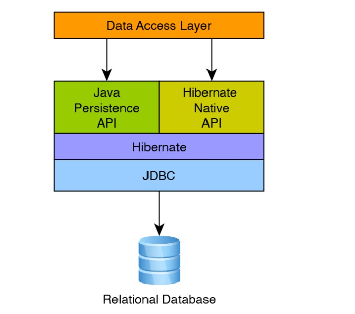
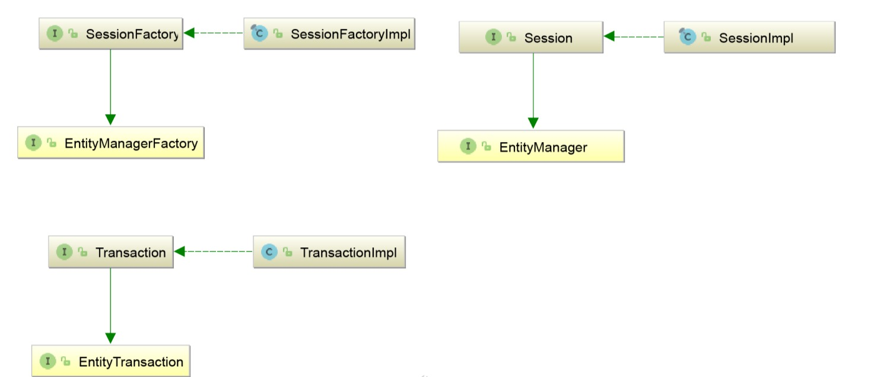
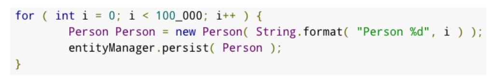

# Introduction d'Hibernate

## Hibernate
+ **Hibernate** est une solution ORM très populaire et mature pour Java
    + **ORM** – Mappage relationnel d'objets
+ Hibernate implémente également la spécification Java JPA
  + Une grande partie des spécifications de l'API était en fait basée sur Hibernate
+ Le codage selon la spécification Java JPA gardera votre code indépendant d'Hibernate.
+ Hibernate dispose également d'une API native
  + Le codage vers cette API rendra votre code dépendant d'Hibernate.

## Conditions Hibernate
+ **Session Factory** - Coûteux à créer, votre application ne doit avoir qu'une seule instance
+ **Entity Manager Factory** – Équivalent JPA de Session Factory
+ **Session** : objet à thread unique et de courte durée. Pas cher à créer
  + La session encapsule une connexion JDBC
+ **Entity Manager** – Équivalent JPA de la session
+ **Transaction** : objet à thread unique et de courte durée pour définir les limites des transactions.
+ **Entity Transaction** – équivalent JPA de Transaction

## Contexte de persistance
+ **Session/Entity Manager** - crée un contexte pour traiter les données persistantes
+ **Transient** – l'entité vient d'être instanciée et n'est pas associée à un contexte de persistance. Il n'a pas de représentation persistante dans la base de données et généralement aucune valeur d'identifiant n'a été attribuée (sauf si le générateur attribué a été utilisé).
+ **Géré ou persistant** - l'entité a un identifiant associé et est associée à un contexte de persistance. Il peut ou non exister physiquement dans la base de données.
+ **Détaché** : l'entité a un identifiant associé mais n'est plus associée à un contexte de persistance (généralement parce que le contexte de persistance a été fermé ou que l'instance a été expulsée du contexte)
+ **Supprimé** - l'entité a un identifiant associé et est associée à un contexte de persistance, cependant, sa suppression est planifiée de
la base de données.

## Entités détachées
+ **Entités détachées** – Erreur très courante à voir
+ La cause première courante est le fait de travailler en dehors de la portée de la session ou d'une session fermée.
+ **Spring Data JPA** effectuera par défaut une transaction implicite
  + Cela signifie que vous pouvez voir cette erreur lors de l'accès aux propriétés de l'entité en dehors d'une transaction.
  + Plus d'informations sur les transactions plus tard!

## Mise en cache
+ **Contexte de persistance / Cache de premier niveau** - Par défaut, Hibernate mettra en cache les entités dans le contexte de persistance
  + Les changements en dehors du contexte peuvent ne pas être visibles
  + Très efficace pour travailler dans le cadre d'une séance
+ **Cache de deuxième niveau** - Désactivé par défaut. Cache au niveau JVM ou cluster
  + Il est recommandé d'activer l'option par entité.
  + Large prise en charge des options populaires telles que jCache, Ehcache et Infinispan

## Problèmes de mise en cache

+ **Hibernate** ajouterait 100 000 objets au cache au niveau de la session, possiblement à cause d'un manque de mémoire
+ Une transaction de longue durée pourrait épuiser le pool de transactions
+ **JDBC Batching** n'est pas activé par défaut, chaque insertion est un aller-retour vers la base de données.
+ Les méthodes **flush()** et **clear()** peuvent être utilisées pour vider le cache de session