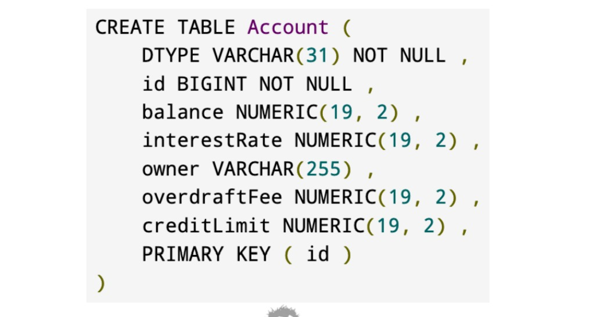
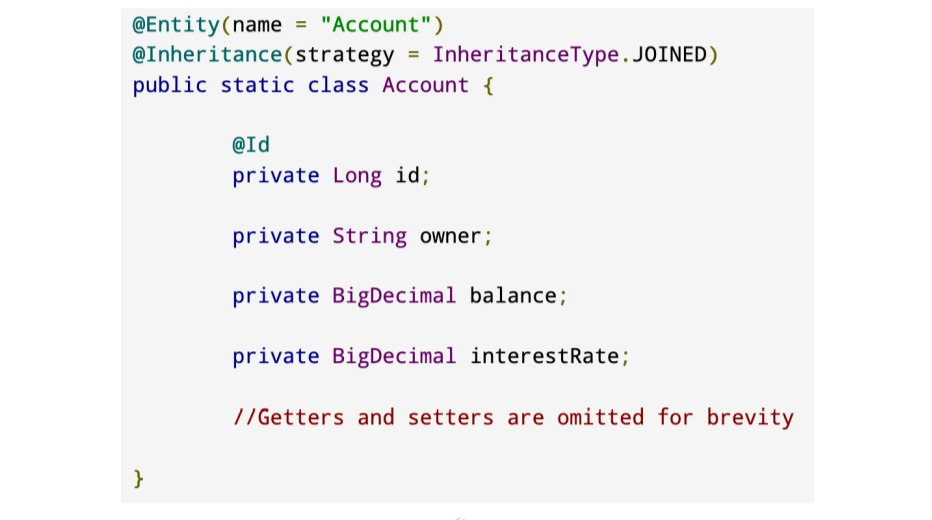

# Héritage JPA

## Héritage JPA
+ L'héritage est un concept fondamental de la programmation orientée objet.
  + Une classe peut hériter des propriétés et des comportements d'autres classes
+ Le modèle relationnel ne prend pas exactement en charge l'héritage
+ Dans un contexte JPA avec héritage, vous vous souciez de la persistance des propriétés

## Héritage JPA
+ **Super classe mappée** : les entités de niveau supérieur héritent des propriétés et disposent d'une table par entité de niveau supérieur.
+ **Table unique** : la hiérarchie des objets est mappée sur une seule table.
  + Valeur par défaut lors de l'utilisation de l'annotation de mappage **@Inheritance**
+ **Table jointe** : les classes de base et les sous-classes ont leur propre table, la récupération de la sous-classe nécessite une jointure
+ **Table par classe** : chaque objet est mappé à une table, les jointures sont utilisées pour créer des entités de niveau supérieur.

## Superclasse cartographiée

## Tableau unique

## Table jointe

## Tableau par classe

## Inconvénients de l’héritage JPA
+ **Fuite** - Un terme pour décrire le moment où les concepts d'un paradigme « s'infiltrent » dans un autre.
  + La propriété Primary Key/Id est un exemple de modèle relationnel qui « fuit » dans l'objet.
  modèle
+ **Superclasse mappée** : n'autorise pas les requêtes polymorphes
+ **Table unique** : nécessite une colonne de discriminateur et des colonnes pour toutes les propriétés des classes enfants.
+ **Table jointe** : nécessite des jointures SQL et un identifiant d'objet dans les tables d'objets enfants.
+ **Table par classe** - Nécessite des jointures d'union complexes pour prendre en charge les requêtes polymorphes.

## Lequel utiliser ?
+ **Les fuites** sont inévitables
+ Fuite  de table unique, de table jointe et de table par classe dans le modèle relationnel et peut être complexe pour les clients non Hibernate.
+ **K.I.S.S.** - **R**estez **S**imple et **S**tupide
+ Mapped Superclass est la plus simple et répond probablement à 85 % des cas d'utilisation.
+ Soyez conscient des autres options et utilisez-les lorsque vous le jugez approprié.