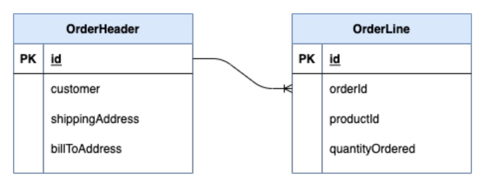
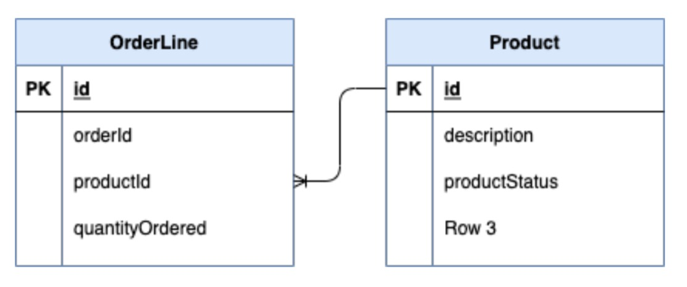
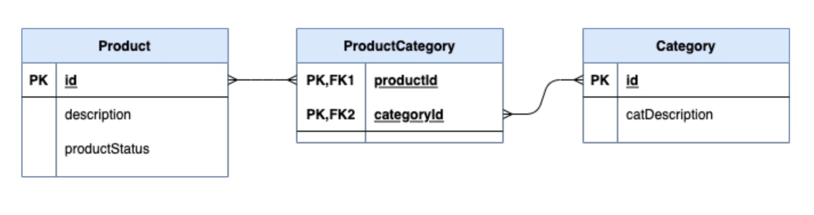
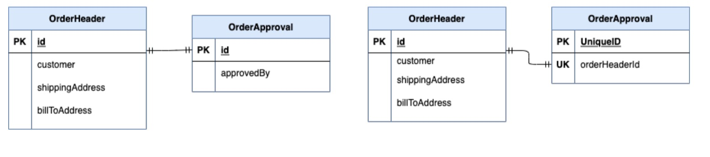
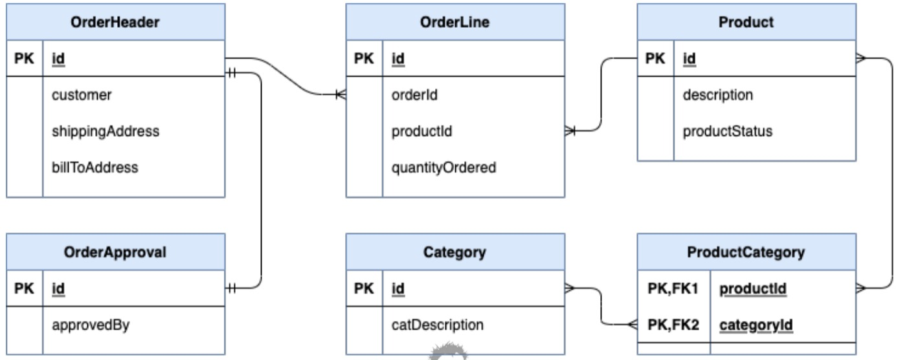

# Relations avec les bases de données

## Relations avec les bases de données
+ `One To One`: les deux tables n'ont qu'un seul enregistrement de chaque côté de la relation.
+ `One To Many` : la table principale comporte un enregistrement lié à zéro ou à plusieurs enregistrements de la table associée.
+ `Many To Many` - Chaque enregistrement des deux tables peut être lié à zéro ou à plusieurs enregistrements de la table associée.

## Contraintes de base de données
+ La meilleure pratique consiste à utiliser les contraintes de base de données pour renforcer les relations.
+ `One To One` : les deux tables peuvent partager la valeur de la clé primaire, ou une table peut avoir sa propre clé primaire et sa propre clé unique dans la colonne ID de la table associée.
+ `One To Many` : la table associée comporte une colonne pour la clé primaire de la table primaire, avec une contrainte de clé étrangère.
+ `Many To Many` : la table de jointure est utilisée avec une clé primaire composite composée des valeurs de clé primaire des tables associées, avec des contraintes de clé étrangère.

## One To Many

## Many To One

## Many To Many

## One To One

## Exemple complet

## Direction de la relation
+ **Bidirectionnel** : la relation est accessible des deux côtés de la relation.
  + Exemples de OrderHeader et de OrderLine - probablement nécessaires des deux côtés.
+ **Unidirectionnel** : la relation peut être accessible des deux côtés de la relation.
  + Exemple de ligne de commande et de produit : il est peu probable que vous ayez besoin d'accéder aux lignes de commande à partir du produit.
  + L'entité Product n'a pas de référence à OrderLine.

## Opérations en cascade
+ **Hibernate** a la capacité de cascader les opérations de persistance
+ Exemple : Une suppression de l'en-tête de commande uniquement échouerait en cas de contraintes de clé étrangère sur OrderLine et OrderApproval.
  + Explicitement, vous devez d'abord effectuer la suppression des enregistrements enfants.
  + En option, Hibernate peut être configuré pour supprimer OrderLines et OrderApproval avant de supprimer OrderHeader.
+ À utiliser avec prudence : vous ne souhaitez pas supprimer les enregistrements de produits lors de la suppression pour OrderLine.

## Déclaration de clé étrangère
+ **JPA** a une annotation **@ForeignKey**
+ Il s'agit uniquement d'informations de métadonnées.
+ Hibernate fera référence à ceci pour la génération de schéma uniquement
+ Il n'est pas appliqué ni généré s'il est manquant
+ Lorsque vous utilisez des outils de migration de schéma comme Liquibase ou Flyway, cela n'est pas nécessaire

## Annexe 

[Plugins : JPA Buddy](https://jpa-buddy.com/documentation/)