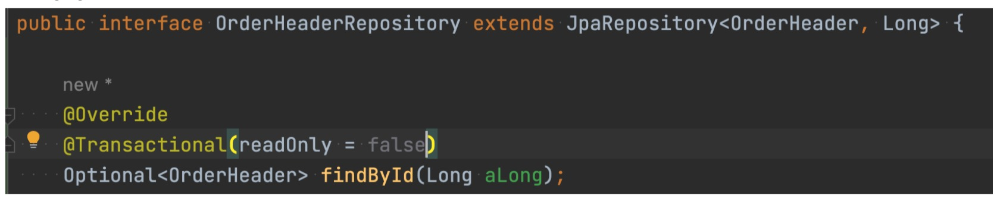
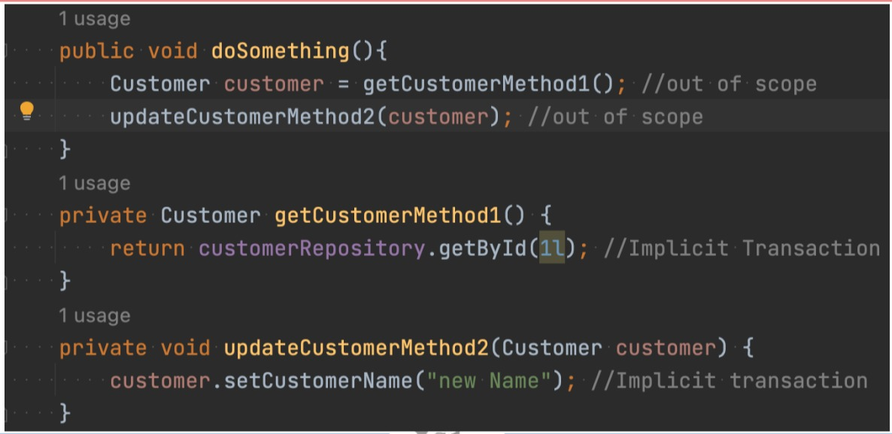
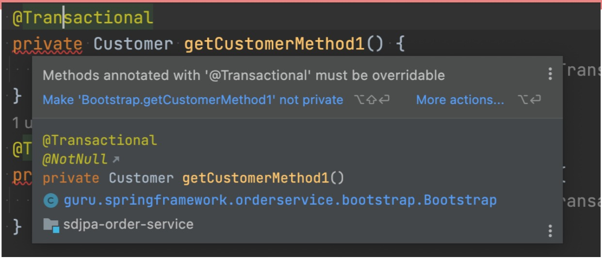
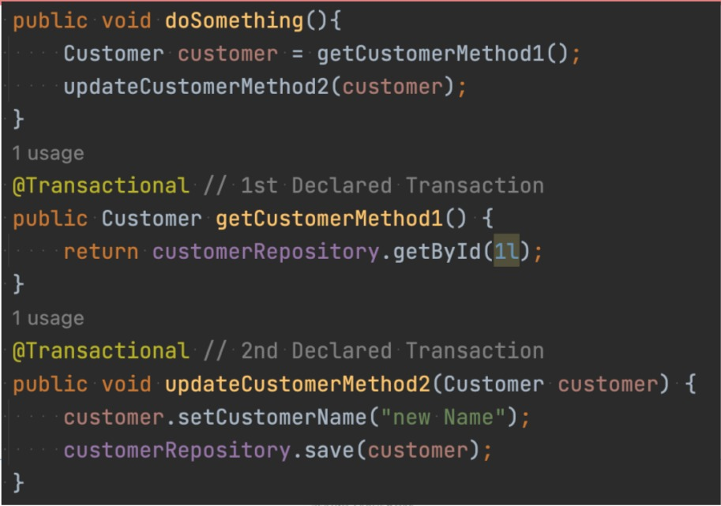

# Transactions de base de données

## Transactions de base de données SQL - ACID
+ **ACID**
  + **Atomicité** - Toutes les opérations sont terminées avec succès ou la base de données est renvoyée à l'état précédent.
  + **Cohérence** - Les opérations ne violent pas les contraintes d'intégrité du système.
  + **Isolé** - Les résultats sont indépendants des transactions simultanées.
  + **Durable** - Les résultats sont rendus persistants en cas de défaillance du système (c'est-à-dire écrits sur le disque)

## Termes importants
+ **Transaction** - Une unité de travail. Une ou plusieurs opérations SQL
  + Généralement des instructions **DML** (et **non DDL**) qui modifient les données.
  + Peut être une seule ; peut être des centaines ou des milliers.
+ **Commit/Validation** - Indique la fin de la transaction et indique à la base de données de rendre les modifications permanentes.
  + Il est plus efficace d'effectuer plusieurs opérations dans une transaction. Les validations ont un « coût ».
+ **Rollback** - Annuler toutes les modifications de la transaction
+ **Save Point/Point de sauvegarde** - Point programmatique que vous pouvez définir, qui vous permet de revenir en arrière (c'est-à-dire de revenir en arrière sur une partie d'une transaction)

## Verrous de base de données
+ La base de données verrouille les enregistrements (dans certains cas la table entière ou la base de données) pour empêcher d'autres processus de modifier les données
  + Conformité ACID
+ Dans une transaction, les instructions DML suivantes verrouillent les enregistrements des lignes affectées :
  + *SELECT FOR UPDATE; UPDATE; DELETE*
+ Pendant les transactions, d'autres sessions tentant de modifier des enregistrements verrouillés attendent par défaut que le verrou soit libéré. ​​(c'est-à-dire que de manière interactive, il semblera que les choses se bloquent)
+ Blocage - Se produit lorsque deux transactions se verrouillent mutuellement et ne peuvent jamais se terminer.
  + Les deux échouent et reviennent en arrière.

## Niveaux d'isolement des transactions
+ **Lecture répétable/Repeatable Read** - Niveau d'isolement par défaut. Votre instruction reçoit une vue cohérente de la base de données, même si d'autres transactions sont validées pendant votre transaction.
  + Votre transaction obtient un instantané des données, qui ne change pas.
+ **Lecture validée/Read Committed** - Les lectures au sein de votre transaction recevront un nouvel instantané des données.
+ **Lecture non validée/Read Uncommitted** - Les lectures ne sont pas cohérentes, mais peuvent éviter des verrous de base de données supplémentaires.
  + également appelé « lecture sale »
+ **Sérialisable/Serializable** - Similaire à la lecture répétable, mais peut verrouiller les lignes sélectionnées dans la transaction.

## Concepts pragmatiques à retenir
+ En utilisant le niveau d'isolement de transaction par défaut, votre transaction voit un instantané de la base de données telle qu'elle est au début de la transaction.
  + Les modifications apportées dans d'autres sessions et validées **NE SERONT PAS** visibles
  + Les modifications apportées par votre session **NE SERONT PAS** visibles pour les autres sessions jusqu'à la validation
+ La plupart des SGBDR modernes font du bon travail en matière de conformité ACID
  + La prise en charge d'ACID avec une base de données NoSQL varie considérablement selon le fournisseur
  + La conformité ACID est complexe et coûteuse - d'où les performances élevées des bases de données NoSQL

## La mise à jour « perdue »
+ L'enregistrement de la base de données a une quantité de 10
+ La session A lit 10, ajoute 5, ce qui donne une quantité de 15, l'enregistrement de la base de données est verrouillé pendant la mise à jour
+ La session B lit 10, ajoute 5, ce qui donne une quantité de 15, mais est bloquée par le verrou de la session A
  + Ce serait 20, si la session B pouvait voir la modification non validée
+ La session A valide l'enregistrement, libérant le verrou. L'enregistrement de la base de données est mis à jour à 15
+ La session B est libérée, met à jour l'enregistrement de la base de données à 15
  + Ainsi, la mise à jour de la session A est « perdue »

## Modes de verrouillage JDBC
+ Les pilotes JDBC prennent en charge plusieurs modes de verrouillage différents
+ Le mode s'applique à la durée de vie de la connexion
+ La configuration dépend **fortement** du fournisseur
+ Rarement utilisé dans la pratique.
+ JPA/Hibernate est généralement privilégié

## Verrouillage JPA
+ **Verrouillage pessimiste**
  + Les mécanismes de base de données sont utilisés pour verrouiller les enregistrements pour les mises à jour
  + Les capacités varient considérablement en fonction de la base de données et de la version du pilote JDBC utilisé
  + La version la plus simple est « SELECT FOR UPDATE… » - Verrouille une ou plusieurs lignes jusqu'à ce que la validation ou la restauration soit émise
+ **Verrouillage optimiste**
  + Effectué en vérifiant un attribut de version de l'entité

## Verrouillage JPA - Lequel utiliser ???
+ **Avez-vous besoin d'un verrouillage ?**
  + Votre application aura-t-elle des mises à jour simultanées des mêmes enregistrements ???
+ **Verrouillage pessimiste**
  + À utiliser si les données sont fréquemment mises à jour et si elles sont mises à jour simultanément
  + N'oubliez pas que l'exécution du verrouillage a un coût
+ **Verrouillage optimiste**
  + À utiliser si les données sont lues plus souvent que mises à jour
  + La majorité des applications utiliseront le verrouillage optimiste

## Conversations multi-requêtes
+ **Conversation multi-requêtes** - Se produit dans les applications de formulaire Web, ou éventuellement **RESTful** également, où la logique de mise à jour s'étend sur une ou plusieurs requêtes, laissant ainsi une fenêtre de temps plus large.
+ Le verrouillage pessimiste est très rapide, quelques millisecondes. Il ne protège contre les conflits qu'au moment de l'écriture.
+ Le verrouillage optimiste fournit un mécanisme permettant de détecter les données obsolètes sur une période plus longue (c'est-à-dire plusieurs requêtes)

## Verrouillage pessimiste JPA
+ **Modes de verrouillage pessimistes**
  + **PESSIMISTIC_READ** - utilise un verrou partagé, empêche la mise à jour ou la suppression des données
  + **PESSIMISTIC_WRITE** - utilise un verrou exclusif, empêche la lecture (dans certains niveaux d'isolement), la mise à jour ou la suppression des données
  + **PESSIMISTIC_FORCE_INCREMENT** - utilise un verrou exclusif, incrémente la propriété de version de l'entité
+ La plupart des bases de données prennent en charge PESSIMISTIC_WRITE, c'est l'option que vous utiliserez généralement
  + Utilisez **PESSIMISTIC_FORCE_INCREMENT** si l'entité a une propriété de version

## Verrouillage optimiste JPA
+ Utilise une propriété de version, qui est incrémentée à chaque mise à jour
+ Peut être de type int, Integer, long, Long, short, Short ou java.sql.Timestamp
  + Le plus courant est Integer
+ Avant une mise à jour, Hibernate lira l'enregistrement de base de données correspondant. Si la version ne correspond pas, une exception est levée
+ **Inconvénients :**
  + Les mises à jour en dehors de JPA/Hibernate qui ne mettent pas à jour la propriété de version interrompront cette opération
  + Performances : lecture avant chaque mise à jour

## Modes de verrouillage optimiste JPA
+ **OPTIMISTIC** : obtient un verrou de lecture optimiste pour toutes les entités avec l'attribut de version
+ **OPTIMISTIC_FORCE_INCREMENT** : identique à **OPTIMISTIC, mais incrémente la valeur de la version
+ **READ** : **JPA 1.x**, identique à **OPTIMISTIC**
+ **WRITE** : **JPA 1.x**, identique à **OPTIMISTIC_FORCE_INCREMENT**

## Transactions Spring Data JPA
+ Spring Data JPA prend en charge par défaut les transactions implicites. Cela signifie que les méthodes du référentiel
créeront une transaction par défaut, s'il n'y a pas de transaction active.
+ Spring Data JPA a deux types de transactions implicites :
  + Les opérations de lecture sont effectuées dans un contexte de lecture seule
  + Les mises à jour et les suppressions sont effectuées avec le contexte transactionnel par défaut
+ Utilisez la lecture seule avec prudence, les vérifications incorrectes sont ignorées, ce qui rend les performances plus élevées
  + Si l'objet du contexte de lecture seule est mis à jour et enregistré, vous pouvez rencontrer des problèmes

## Transactions de test Spring Boot
+ Spring Boot crée par défaut une transaction pour vos tests et la restaure
+ Les transactions implicites Spring Data JPA ne sont PAS utilisées dans le contexte de test
  + Les transactions implicites ne sont utilisées qu'en dehors d'un contexte transactionnel
+ Si vous avez une méthode en cours de test avec un ou plusieurs appels de méthode de référentiel, vous pouvez voir des résultats différents lorsqu'elle est exécutée en dehors du contexte de test
  + En général, une erreur d'entité détachée due à l'accès aux propriétés de chargement différé en dehors du contexte Hibernate.

## Déclaré avec l'annotation @Transactional
+ Spring Framework fournit une annotation `@Transactional` dans le package `“org.springframework.transaction.annotation”`
+ JEE fournit également une annotation `@Transactional` dans le package `“javax.transaction”`
+ Spring prendra en charge les deux options
  + Spring 4.x peut avoir des problèmes de compatibilité
+ Il est recommandé d'utiliser la version `@Transactional` de Spring Framework
  + Plus polyvalent et spécifique à Spring que `@Transactional` de JEE

## Annotation @Transactional de Spring
+ Attributs d'annotation transactionnelle :
  + **value / transactionManager** - le nom du gestionnaire de transactions à utiliser
  + **label** - Chaîne pour décrire une transaction
  + **Propagation** - Le type de propagation de transaction
  + **Isolation** - Niveau d'isolement de transaction
  + **timeout** - Délai d'expiration de la transaction
  + **readOnly** - est en lecture seule ?

## Annotation @Transactional de Spring - Suite
+ Attributs d'annotation transactionnelle :
  + **rollbackFor / rollbackforClassName** - Exceptions pour lesquelles il faut effectuer une restauration
  + **NoRollbackFor / noRollbackforClassName** - Exceptions pour lesquelles il ne faut PAS effectuer de restauration.

## @Transactional - Gestionnaire de transactions
+ Spring Boot configurera automatiquement une instance d'un gestionnaire de transactions en fonction de vos dépendances
+ Spring Framework fournit une interface appelée PlatformTransactionManager
+ Implémentations disponibles pour JDBC, JTA (JEE), Hibernate, etc.
+ Spring Boot configure automatiquement l'implémentation appropriée
+ Instance configurée automatiquement nommée **transactionManager** 

## @Transactional - Propagation des transactions
+ **REQUIRED** - (Par défaut) - utiliser une transaction existante ou créer une nouvelle transaction
+ **SUPPORTS** - Utiliser une transaction existante ou exécuter de manière non transactionnelle si aucune n'existe
+ **MANDATORY** - Prendre en charge la transaction actuelle, générer une exception si aucune n'existe
+ **REQUIRES_NEW** - Créer une nouvelle transaction, suspendre la transaction actuelle
+ **NOT_SUPPORTED** - Exécuter de manière non transactionnelle, suspendre la transaction actuelle si elle existe
+ **NEVER** - Exécuter de manière non transactionnelle, générer une exception si la transaction existe
+ **NESTED** - Utiliser transaction imbriquée si la transaction existe, créer si non.

## @Transactional - Niveau d'isolement des transactions
+ **DEFAULT** - (Par défaut) Utiliser le niveau de connexion JDBC
+ **READ_UNCOMMITTED** - Autorise les lectures sales et non répétables
+ **READ_COMMITTED** - Empêche les lectures sales, empêche la lecture de lignes avec des modifications non validées
+ **REPEATABLE_READ** - Empêche les lectures sales et non répétables
+ **SERIALIZABLE** - empêche toutes les lectures sales, similaire à **REPEATABLE_READ**, et effectue une deuxième lecture pour vérifier

## @Transactional - Délai d'expiration des transactions
+ La valeur par défaut est -1, ce qui permet d'utiliser l'implémentation sous-jacente
+ Spring Boot ne remplace pas cela
+ Sauf si elle est définie spécifiquement au niveau de la connexion, la valeur par défaut est le paramètre de la plateforme 
  + Pour MySQL, il s'agit de 8 heures

## @Transactional - Lecture seule
+ Par défaut, la propriété readOnly est définie sur false
  + Spring Data JPA pour les transactions impliquées des méthodes de lecture définira ceci sur true
+ L'utilisation de la propriété readOnly sur true permet à Hibernate d'effectuer certaines optimisations d'efficacité
  + Ce n'est PAS garanti
+ NE PAS UTILISER si vous prévoyez de mettre à jour et d'enregistrer les entités récupérées

## @Transactional - RollbackFor / NoRollbackFor
+ Par défaut, les exceptions d'exécution non gérées seront annulées
+ En général, la valeur par défaut convient à la plupart des situations
+ Peut être utile lorsque vous souhaitez annuler une transaction enfant, mais pas la transaction entière

## Utilisation de @Transactional au niveau du référentiel
+ Les méthodes du référentiel Spring Data JPA peuvent être remplacées et personnalisées au niveau du référentiel

## Transactions implicites

## N'utilisez pas de méthodes privées

## Transactions déclarées et portée

